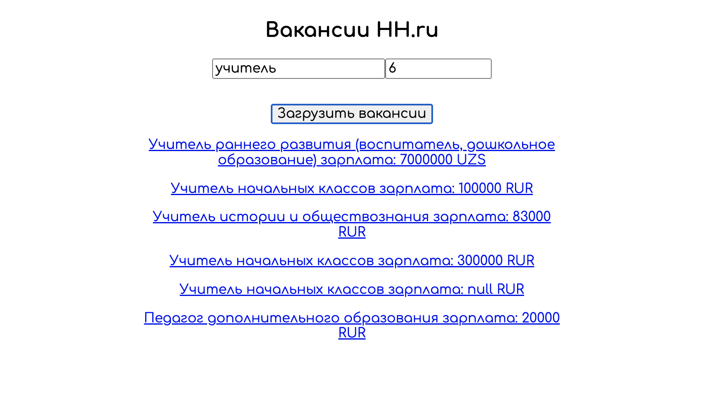
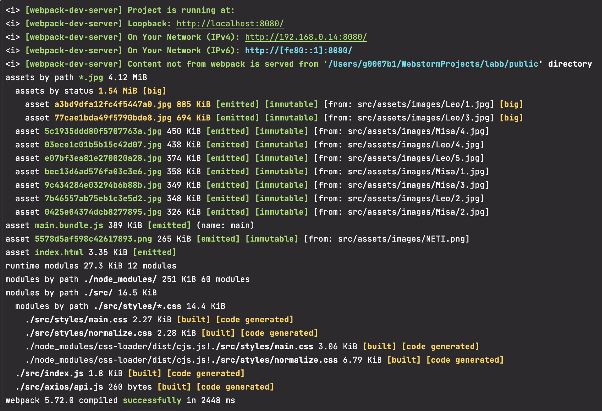

# Лабораторная работа №3
## Использование npm, webpack и REST API

### Чтобы запустить проект нужно:
1) Иметь подключение к интернету
2) Сделать git clone репозитория
3) В терминале прописать следующие команды:
4) npm run build - создает директорию dist со сборкой и можно запустить index.html или
5) npm run start - запускает сервер с динамическим обновлением

### Проект с адаптивной разметкой!
####

####Внимание! 
Внешний вид будет некорректно отображаться в браузере Safari, о чем предупредит алерт при запуске в этом браузере

